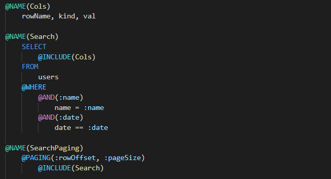
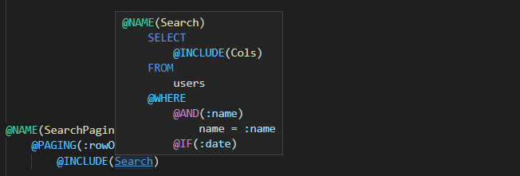
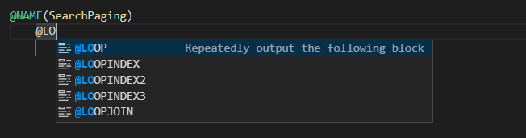

# ElSQL Language Support

VS Code language support for [ElSQL](https://github.com/OpenGamma/ElSql), the Java SQL DSL.

## Features

### Syntax highlighting



### View implementation

Go to implementation or hover preview @NAME blocks from @INCLUDE references.


### Code completion



### More features

- Rename variables and @NAME blocks
- Hover for ElSQL tag documentation
- Document symbols overview
- Function signature help

### Coming Soon

- Find all references to variables and @NAME blocks
- Format blocks

## Structure

```ini
.
├── client # ElSQL Language Client
│   └── src
│       └── extension.ts # Entry point
│
├── elsql # ElSQL Language Support
│   ├── elsql.tmLanguage.json # TextMate grammar
│	└── language-configuration.json # Editor config
│
├── package.json # Extension manifest
│
└── server # ElSQL Language Server
    └── src
        ├── models # Language tags, params, and docs
		├── providers # Language feature providers
		├── services # Stateful services
		├── utils # Stateless utilities
		└── server.ts # Entry point
```

## Launching the LS

- Run `npm install` in this folder. This installs all necessary npm modules in both the client and server folder
- Open VS Code on this folder.
- Press Ctrl+Shift+B to compile the client and server.
- Switch to the Debug viewlet.
- Select `Launch Client` from the drop down.
- Run the launch config.
- If you want to debug the server as well use the launch configuration `Attach to Server`
